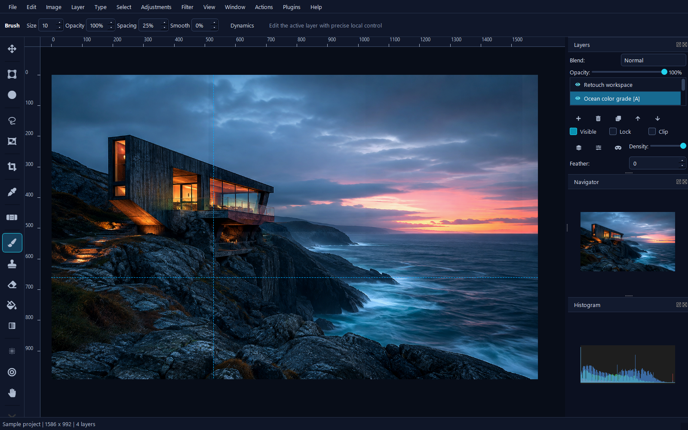
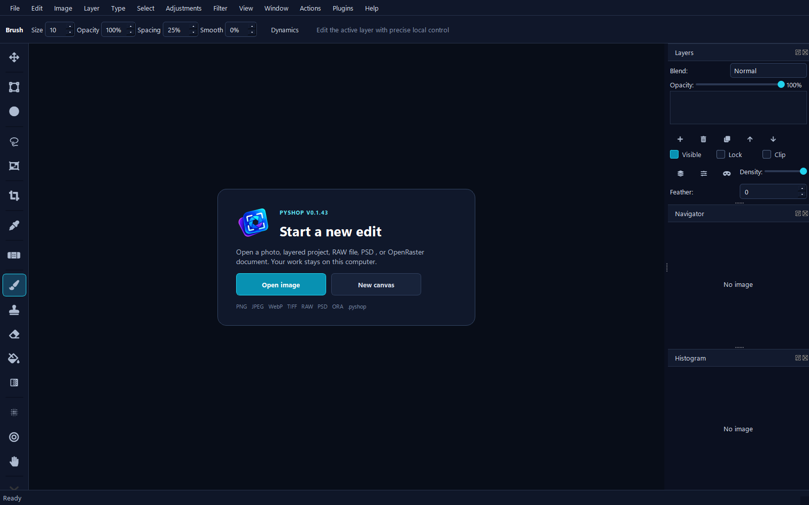
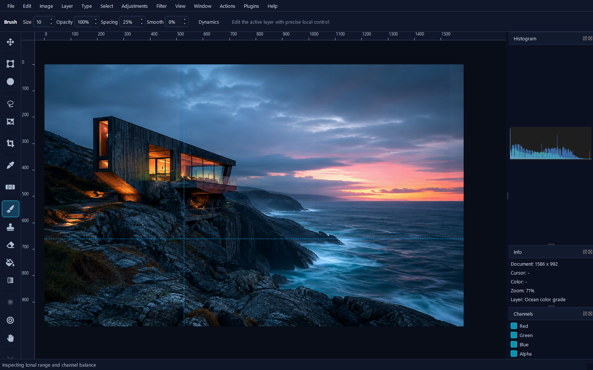
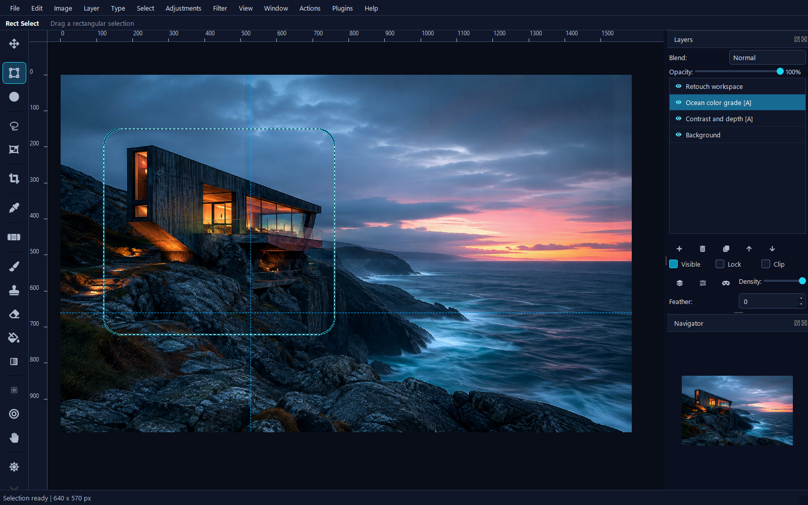

<p align="center">
  
</p>

# PyShop


Edit layered images on Windows without handing your files to a cloud service.

PyShop is an early-stage desktop image editor for layered projects. Work with masks and editable effects, inspect color channels, then save a native project you can return to later. No account is required. Your images stay on your computer.

[](https://github.com/SysAdminDoc/PyShop/releases/latest/download/PyShop-v0.1.43-win64.zip)



The screenshots show the packaged Windows editor with a sample composition. The cabin artwork is demonstration material, not a documentary photograph. [Capture details](assets/screenshots/capture-report.json) tie these images to the release executable.

## Why PyShop

| | |
|---|---|
| **Layered projects** | Build an edit with reorderable layers, opacity, masks, groups, blend modes, text, and vector shapes. |
| **Useful selection tools** | Work with marquee, lasso, magic wand, crop, path, and channel-based workflows. |
| **Editable effects** | Add adjustments and effect layers, then rasterize only when the result is ready. |
| **Practical imports** | Open common raster images, camera RAW files, PSD documents, and OpenRaster projects. |
| **Safer sessions** | Atomic saves, autosave recovery projects, undo history, and job error logs help protect work in progress. |
| **Local by design** | PyShop does not upload images or require an account. |

## A workspace that gets out of the way

The first screen offers two clear choices. Open an image or create a blank canvas. Once a document is active, the options bar follows the selected tool so unrelated controls do not crowd the canvas.

<table>
  <tr>
    <td width="50%"></td>
    <td width="50%"></td>
  </tr>
  <tr>
    <td align="center"><strong>Start quickly</strong></td>
    <td align="center"><strong>Inspect the image</strong></td>
  </tr>
  <tr>
    <td colspan="2"></td>
  </tr>
  <tr>
    <td colspan="2" align="center"><strong>Make precise selections without losing the full composition</strong></td>
  </tr>
</table>

## Install on Windows

1. Download the [latest Windows ZIP](https://github.com/SysAdminDoc/PyShop/releases/latest/download/PyShop-v0.1.43-win64.zip).
2. Extract the archive.
3. Run `PyShop.exe`.

The current Windows build is not code-signed, so SmartScreen may identify it as an unknown publisher. The release includes a SHA-256 checksum for file verification.

The ZIP includes this guide, its screenshots, and the original artwork archive. You don't need Python to run the packaged app. The [matching source release](https://github.com/SysAdminDoc/PyShop/tree/v0.1.43) is available separately.

## Run from source

Python 3.10 through 3.12 is supported.

```powershell
git clone https://github.com/SysAdminDoc/PyShop.git
cd PyShop
python -m venv .venv
.venv\Scripts\python -m pip install -r requirements.txt
.venv\Scripts\python pyshop_image_editor.py
```

For tests and release tooling, use PowerShell 7:

```powershell
.venv\Scripts\python -m pip install -r requirements-dev.txt
.venv\Scripts\python -m pytest -q
.\tools\build-release.ps1 -BuildOnly
.\tools\capture-marketing.ps1 -Executable "$PWD\dist\PyShop.exe"
.\tools\smoke-release.ps1
```

The capture and smoke helpers require an isolated Windows desktop harness. They don't use the active display or your saved preferences. Review the four images in `build/marketing-capture`, then copy the PNGs and `capture-report.json` into `assets/screenshots`. Finish with `.\tools\build-release.ps1 -PackageOnly`. Packaging rejects stale captures, altered original concepts, and missing guide images.

## File workflows

- Save complete edits as native `.pyshop` projects.
- Import PSD and OpenRaster documents with supported layer data.
- Export flattened images, layered PSD files, or OpenRaster archives.
- Build reusable export presets and batch-convert multiple inputs.
- Open camera RAW files supported by `rawpy`.
- Record actions as reusable `.pyshopmacro` files.

Some application-specific metadata has no direct PSD or OpenRaster equivalent. PyShop reports compatibility notes before those exports so you can keep the native project as the master copy.

## Windows integration

PyShop can register `.pyshop` files for the current Windows user and add an Explorer action for supported images. Preview the commands first:

```powershell
python -m pyshop.windows_shell print
```

## Development status

PyShop is active, early-stage software. Keep an original copy of important source images, especially when exchanging complex PSD files with other editors. Bug reports with a small sample file and exact reproduction steps are welcome.

## Related project

Need an editor that runs from a single HTML file? [OpenShop](https://github.com/SysAdminDoc/OpenShop) works offline in a browser and requires no installation.

## Artwork

The [original concept archive](assets/brand/concepts/README.md) preserves all five studies and records the selected logo. The production identity remains the layered aperture, with a separate optical-size master for smaller icons.

## License

PyShop is licensed under the [GNU General Public License v3.0](LICENSE). PyQt5 is available under the GPL or a commercial Riverbank license.
